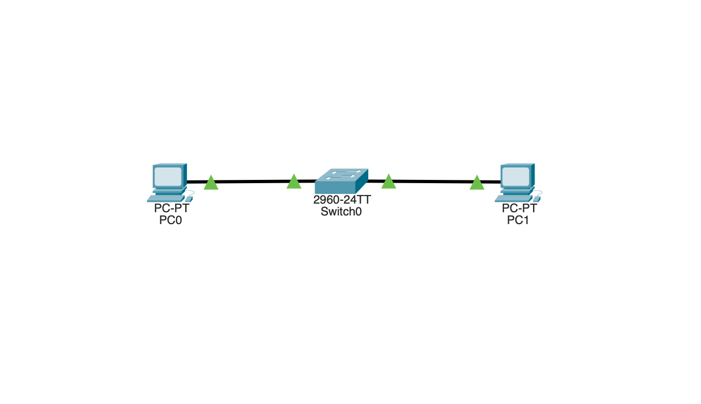

# Lab 03: Network Addressing

## Overview
This lab demonstrates basic IP addressing within a single network. It focuses on understanding network address, broadcast address, and valid host range using a /24 subnet.

---

## Topology
PC0 ─── Switch ─── PC1



---

## Devices Used
- 2 × PCs (PC0, PC1)  
- 1 × Switch (2960)  

---

## Network Configuration

### Network
- Network Address: 192.168.10.0  
- Subnet Mask: 255.255.255.0 (/24)  

---

### PC0
- IP Address: 192.168.10.1  
- Subnet Mask: 255.255.255.0  

---

### PC1
- IP Address: 192.168.10.2  
- Subnet Mask: 255.255.255.0  

---

## Connectivity Test

Command used:

```
192.168.10.2
```


Result:
- Successful replies received  
- No packet loss  

---

## What Actually Happens

1. PC0 checks the destination IP (192.168.10.2).  
2. It identifies that the destination is in the same network.  
3. PC0 sends the packet to the switch.  
4. The switch forwards the data to PC1 using MAC addressing.  
5. PC1 receives the packet and replies back.  

---

## Key Concepts Learned

- A network address identifies the network and cannot be assigned to devices  
- A broadcast address is used to send data to all devices in a network  
- Valid host range is used for assigning IP addresses to devices  
- Devices in the same network communicate directly through a switch  

---

## Network Addressing Breakdown

### Network Address
- 192.168.10.0  
- Identifies the network  
- Not assignable to devices  

---

### Broadcast Address
- 192.168.10.255  
- Used to send data to all devices in the network  
- Not assignable to devices  

---

### Valid Host Range
- 192.168.10.1 → 192.168.10.254  
- Usable IP addresses for devices  

---

## Key Takeaway

In a /24 network, the first address represents the network, the last address is the broadcast address, and all addresses in between are valid for devices.

---

## Interview Explanation

**What is a network address?**  
A network address identifies the network and cannot be assigned to any device.

---

**What is a broadcast address?**  
A broadcast address is used to send data to all devices in a network and cannot be assigned to a device.

---

**What is a host range?**  
Host range refers to the set of IP addresses that can be assigned to devices within a network.

---

**Why can't .0 and .255 be assigned?**  
.0 represents the network address and .255 represents the broadcast address, so they are reserved and cannot be used by devices.

---

## How to Run

1. Open the `.pkt` file using Cisco Packet Tracer  
2. Click on PC0 → Desktop → Command Prompt  
3. Run:
```
192.168.10.2
```

Result:
- Successful replies received  
- No packet loss  

---

## What Actually Happens

1. PC0 checks the destination IP (192.168.10.2).  
2. It identifies that the destination is in the same network.  
3. PC0 sends the packet to the switch.  
4. The switch forwards the data to PC1 using MAC addressing.  
5. PC1 receives the packet and replies back.  

---

## Key Concepts Learned

- A network address identifies the network and cannot be assigned to devices  
- A broadcast address is used to send data to all devices in a network  
- Valid host range is used for assigning IP addresses to devices  
- Devices in the same network communicate directly through a switch  

---

## Network Addressing Breakdown

### Network Address
- 192.168.10.0  
- Identifies the network  
- Not assignable to devices  

---

### Broadcast Address
- 192.168.10.255  
- Used to send data to all devices in the network  
- Not assignable to devices  

---

### Valid Host Range
- 192.168.10.1 → 192.168.10.254  
- Usable IP addresses for devices  

---

## Key Takeaway

In a /24 network, the first address represents the network, the last address is the broadcast address, and all addresses in between are valid for devices.

---

## Interview Explanation

**What is a network address?**  
A network address identifies the network and cannot be assigned to any device.

---

**What is a broadcast address?**  
A broadcast address is used to send data to all devices in a network and cannot be assigned to a device.

---

**What is a host range?**  
Host range refers to the set of IP addresses that can be assigned to devices within a network.

---

**Why can't .0 and .255 be assigned?**  
.0 represents the network address and .255 represents the broadcast address, so they are reserved and cannot be used by devices.

---

## How to Run

1. Open the `.pkt` file using Cisco Packet Tracer  
2. Click on PC0 → Desktop → Command Prompt  
3. Run:
```
ping 192.168.10.2
```
4. Observe successful replies  

---

## Conclusion

This lab builds foundational knowledge of IP addressing and helps in understanding how networks are structured and how devices are assigned valid IP addresses.
